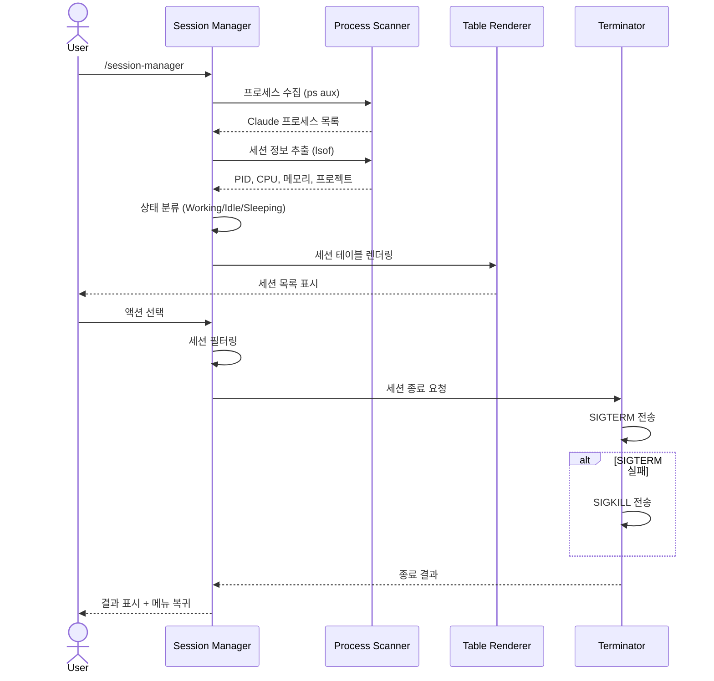

# Claude Session Manager Plugin

백그라운드에서 실행 중인 Claude Code 세션을 한눈에 모니터링하고, 불필요한 세션을 정리할 수 있는 CLI 플러그인입니다.

[English](./README.md)

## 개요

Claude Code를 여러 프로젝트에서 동시에 사용하다 보면 백그라운드 세션이 쌓여 CPU와 메모리를 차지하게 됩니다. 이 플러그인은 세션 상태를 시각적으로 보여주고, Sleeping/오래된/고메모리 세션을 선택적으로 정리할 수 있게 해줍니다.

- 실행 중인 모든 Claude Code 세션을 테이블 형태로 표시
- 프로젝트별 세션 구분 및 상태(Working / Idle / Sleeping) 표시
- CPU 사용률, 메모리 사용량, 시작 시간 등 상세 정보 제공
- 선택적 세션 종료 (개별 / Sleeping 일괄 / 오래된 세션 / 고메모리 세션)
- 세션 통계 대시보드
- 안전한 종료 (SIGTERM 우선, 실패 시에만 SIGKILL)
- 임계값 커스터마이징 지원


## 파이프라인 구조

플러그인은 `수집 → 표시 → 선택 → 실행`의 선형 파이프라인으로 동작합니다.



## 요구 사항

- **Node.js** 14 이상
- **Claude Code** 2.0.0 이상
- **macOS / Linux** (프로세스 조회에 `ps`, `lsof` 사용)

## 설치

### GitHub에서 직접 설치

```bash
claude plugin install https://github.com/yhyuk/claude-session-manager-plugin.git
```

### 로컬 설치 (개발 용도)

```bash
git clone https://github.com/yhyuk/claude-session-manager-plugin.git
cd claude-session-manager-plugin
npm install
claude plugin install .
```

## 사용법

### 세션 관리자 (메인 UI)

```bash
/session-manager
# 또는 단축 명령어
/csm
```

인터랙티브 메뉴가 표시되며 다음 작업을 선택할 수 있습니다:

- 특정 세션 종료
- 모든 Sleeping 세션 종료
- 고메모리 세션 종료
- 오래된 세션 종료
- 새로고침

### 빠른 명령어

| 명령어 | 단축키 | 설명 |
|--------|--------|------|
| `/session-manager` | `/csm`, `/sessions` | 세션 관리자 UI 실행 |
| `/kill-sleeping` | `/ks` | Sleeping 세션 모두 종료 |
| `/kill-old` | `/ko` | 오래된 세션 종료 |
| `/session-stats` | `/stats` | 세션 통계 보기 |

## 설정

임계값은 코드 상단의 `DEFAULT_CONFIG` 객체에서 관리됩니다:

```javascript
const DEFAULT_CONFIG = {
  thresholds: {
    sleepingCpu: 1,      // CPU% 미만이면 Sleeping 상태
    workingCpu: 5,       // CPU% 초과이면 Working 상태
    highMemoryMB: 100,   // MB 이상이면 고메모리 세션
    oldSessionHours: 24  // 시간 이상이면 오래된 세션
  }
};
```

프로그래밍 방식으로 커스터마이징할 수도 있습니다:

```javascript
const ClaudeSessionManager = require('claude-session-manager');

const manager = new ClaudeSessionManager({
  thresholds: {
    sleepingCpu: 2,
    highMemoryMB: 200,
    oldSessionHours: 12
  }
});
```

### 세션 상태 기준

| 상태 | CPU 사용률 | 의미 |
|------|-----------|------|
| **Working** | > `workingCpu` (기본 5%) | 활발히 작업 중 |
| **Idle** | `sleepingCpu` ~ `workingCpu` (기본 1%~5%) | 대기 상태 |
| **Sleeping** | < `sleepingCpu` (기본 1%) | 휴면 상태 (정리 대상) |

## 프로젝트 구조

```
claude-session-manager-plugin/
├── src/
│   └── index.js          # 메인 세션 관리 로직
├── plugin.json            # Claude Code 플러그인 메타데이터
├── package.json
├── install.sh             # 설치 스크립트
├── LICENSE
└── README.md
```

## 안전 기능

- 모든 종료 작업 전 확인 프롬프트 표시
- SIGTERM(안전한 종료)을 우선 사용하고, 실패 시에만 SIGKILL 적용
- 현재 작업 중인(Working) 세션은 자동 정리 대상에서 제외

## 문제 해결

### 세션이 표시되지 않는 경우

프로세스 조회 권한이 필요할 수 있습니다:

```bash
sudo claude /session-manager
```

### 플러그인이 인식되지 않는 경우

```bash
claude plugin list    # 설치된 플러그인 확인
claude plugin reload  # 플러그인 다시 로드
```

### 세션 종료가 안 되는 경우

일부 프로세스는 루트 권한이 필요할 수 있습니다. `sudo`로 재시도하거나, 터미널에서 직접 `kill -9 <PID>`를 실행해주세요.

## License

[MIT](LICENSE)
