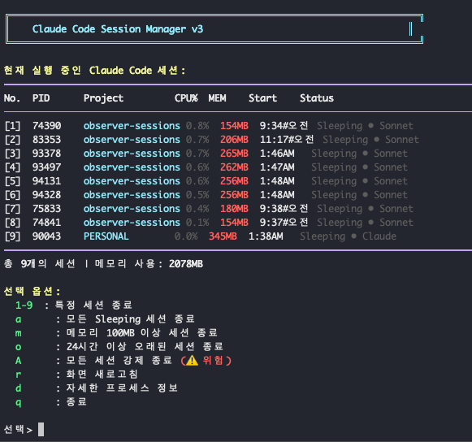
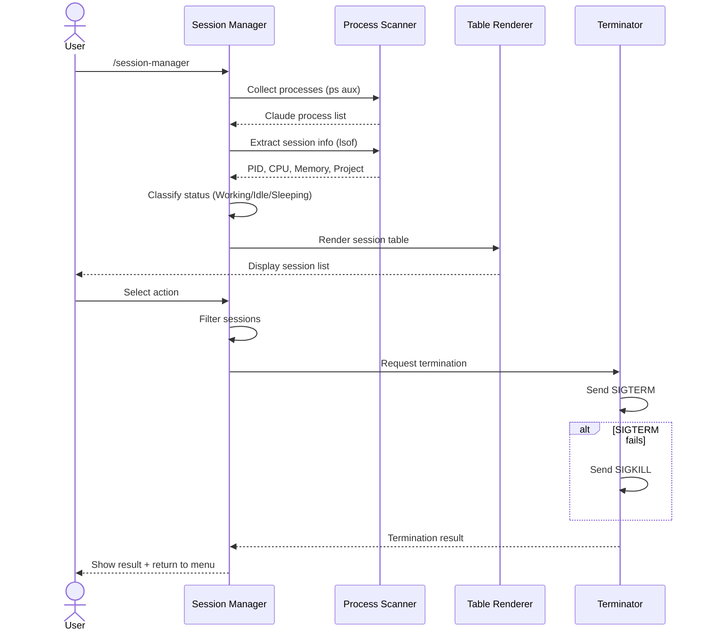

# Claude Session Manager Plugin

Monitor and manage background Claude Code sessions from the terminal. Kill sleeping, old, or high-memory sessions to save CPU and memory.

[한국어](./README.ko.md)

## Overview

When using Claude Code across multiple projects simultaneously, background sessions accumulate and consume CPU and memory. This plugin visually displays session status and allows you to selectively clean up Sleeping, old, or high-memory sessions.

- Display all running Claude Code sessions in a table
- Per-project session grouping with status (Working / Idle / Sleeping)
- Detailed info: CPU usage, memory, start time
- Selective termination (individual / sleeping / old / high-memory)
- Session statistics dashboard
- Safe termination (SIGTERM first, SIGKILL as fallback)
- Configurable thresholds



## Pipeline Architecture

The plugin operates as a linear pipeline: `Collect → Display → Select → Execute`.



## Requirements

- **Node.js** 14+
- **Claude Code** 2.0.0+
- **macOS / Linux** (uses `ps` and `lsof` for process inspection)

## Installation

### Install directly from GitHub

```bash
claude plugin install https://github.com/yhyuk/claude-session-manager-plugin.git
```

### Local installation (for development)

```bash
git clone https://github.com/yhyuk/claude-session-manager-plugin.git
cd claude-session-manager-plugin
npm install
claude plugin install .
```

## Usage

### Session Manager (Main UI)

```bash
/session-manager
# or shorthand
/csm
```

An interactive menu will appear with the following options:

- Terminate a specific session
- Terminate all Sleeping sessions
- Terminate high-memory sessions
- Terminate old sessions
- Refresh

### Quick Commands

| Command | Shorthand | Description |
|---------|-----------|-------------|
| `/session-manager` | `/csm`, `/sessions` | Launch the session manager UI |
| `/kill-sleeping` | `/ks` | Kill all sleeping sessions |
| `/kill-old` | `/ko` | Kill old sessions |
| `/session-stats` | `/stats` | View session statistics |

## Configuration

Thresholds are managed in the `DEFAULT_CONFIG` object at the top of the code:

```javascript
const DEFAULT_CONFIG = {
  thresholds: {
    sleepingCpu: 1,      // Below this CPU% = Sleeping
    workingCpu: 5,       // Above this CPU% = Working
    highMemoryMB: 100,   // At or above this MB = high-memory session
    oldSessionHours: 24  // At or above this hours = old session
  }
};
```

You can also customize programmatically:

```javascript
const ClaudeSessionManager = require('claude-session-manager');

const manager = new ClaudeSessionManager({
  thresholds: {
    sleepingCpu: 2,
    highMemoryMB: 200,
    oldSessionHours: 12
  }
});
```

### Session Status Criteria

| Status | CPU Usage | Meaning |
|--------|-----------|---------|
| **Working** | > `workingCpu` (default 5%) | Actively processing |
| **Idle** | `sleepingCpu` ~ `workingCpu` (default 1%~5%) | Waiting / standby |
| **Sleeping** | < `sleepingCpu` (default 1%) | Dormant (cleanup candidate) |

## Project Structure

```
claude-session-manager-plugin/
├── src/
│   └── index.js          # Main session management logic
├── plugin.json            # Claude Code plugin metadata
├── package.json
├── install.sh             # Installation script
├── LICENSE
└── README.md
```

## Safety Features

- Confirmation prompt shown before all termination actions
- SIGTERM (graceful shutdown) is used first; SIGKILL is only applied on failure
- Sessions currently in Working status are excluded from automatic cleanup

## Troubleshooting

### Sessions not appearing

Process inspection may require elevated permissions:

```bash
sudo claude /session-manager
```

### Plugin not recognized

```bash
claude plugin list    # Check installed plugins
claude plugin reload  # Reload plugins
```

### Session termination fails

Some processes may require root privileges. Retry with `sudo`, or run `kill -9 <PID>` directly in the terminal.

## License

[MIT](LICENSE)
